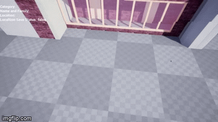
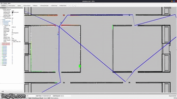

# cad2cav_onboard
Welcome to the on-board part of CAD2CAV project. For a detailed project documentation, see [the main repo.](https://github.com/mlab-upenn/ISP2021-cad2cav).




## System Requirements
- Linux Ubuntu (tested on 20.04 LTS and 18.04 LTS)
- ROS Noetic
- GCC 8+/Clang 8+ (support for C++17 and std::filesystem)

## Software Requirements
- Boost 1.71
- [OpenCV 4.4.0](https://github.com/opencv/opencv/tree/4.4.0)
- [TensorRT 7.2.3.4](https://developer.nvidia.com/nvidia-tensorrt-7x-download)

First run and install the following packages from Ubuntu repository:
```bash
sudo apt install libboost-all-dev
```

Then install other dependencies (OpenCV, TensorRT) manually, by either building from source or following the official documentation.
## Installation
The entire process is ready for installation on an F1/10 Autonomous Racing Car, which uses an **Nvidia Jetson TX2** Board. Users must also install the system-level drivers for F1/10 cars from [this repository.](https://github.com/f1tenth/f1tenth_system.git)

```bash
mkdir -p ~/catkin_ws/src
cd ~/catkin_ws
catkin_init_workspace
cd src
git clone https://github.com/mlab-upenn/ISP2021-cad2cav.git
git clone https://github.com/f1tenth/f1tenth_system.git
cd ..
```

To build the project, run
```bash
catkin_make_isolated --use-ninja
source devel_isolated/setup.bash
```

## Usage
1. For object detection, run

```bash
rosrun object_detection object_detection_node --model=darknet
```
You can also specify a pre-recorded video to visualize by adding `--video=<PATH_TO_VIDEO>` as a command line argument.

## Introduction
**The object detection** part of project uses a pre-trained model of Tiny-YOLO v4 directly from [the author's website.](https://github.com/AlexeyAB/darknet)
